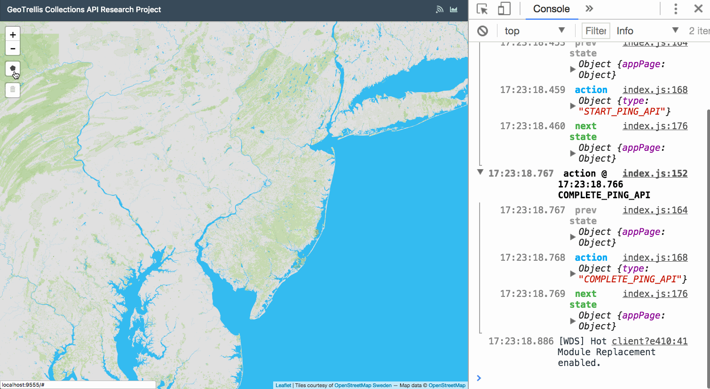

# geotrellis-collections-api-research

[](https://travis-ci.org/azavea/geotrellis-collections-api-research)

A research project to set up and use GeoTrellis as a REST service.



### Requirements

* Make
* Docker
* sbt
* Spark

### Getting started

#### Setup

Clone the project, ensure Docker's running, then run:

```sh
make
```

This will build the app client & compile the API service.

#### Data

To run the API you'll need credentials for accessing Azavea's raster data sets.
Set them by running `aws configure --profile <PROFILE>` where `<PROFILE>`
represents your credentials.

To ingest the NLCD Pennslvania 1992 dataset, [download the file](http://www.pasda.psu.edu/uci/DataSummary.aspx?dataset=339), unzip it and save the `.tif` file in `./ingest/land-cover-data/geotiff`, then run

```sh
make ingest
```

Note that this command requires that you have Spark installed locally with
`spark-submit` on your path.

The resulting RDD will save to `./ingest/land-cover-data/catalog`.

#### Server

To start the app & API servers, run:

```
make server
```

This will start servers to run the app on port `9555` and the API on port `7000`.

### Ports

| Port | Service |
| --- | --- |
| [9555](http://localhost:9555) | Webpack dev server |
| [7000](http://localhost:7000) | GeoTrellis API |

### API Endpoints

Each of these API endpoints accepts a polygon geometry object posted from the client:

| Path | Service |
| --- | --- |
| `/nlcdcount` | Returns NLCD cell counts arranged by type for AOI |
| `/slopepercentagecount` | Returns slope percentage cell counts |
| `/soilgroupcount` | Returns SSUGRO hydrologic soil groups |
| `/soilgroupslopecount` | Returns cell counts for paired soil groups & slope percentages |
| `/nlcdslopecount` | Returns cell counts for paired NLCD & slope percentages |
| `/soilslopekfactor` | Returns average k factor for paired soil types & slope percentages |
| `/nlcdpngtile` | Returns an AOI-shaped PNG tile representing NLCD cell counts |
| `/soilgeotiff` | Returns an AOI-shaped GeoTiff representing soil count values |

### Make rules

| Rule | Description |
| --- | --- |
| `make build` | Install app container npm dependencies |
| `make compile` | Compile app & api for CI |
| `make app-console` | Log into app container shell |
| `make api-console` | Log into API with `./sbt console` |
| `make restart` | Start API with `./sbt ~reStart` |
| `make server` | Start app container & API service |
| `make ingest` | Ingest Pennsylvania NLCD GeoTiff into GeoTrellis RDD |
